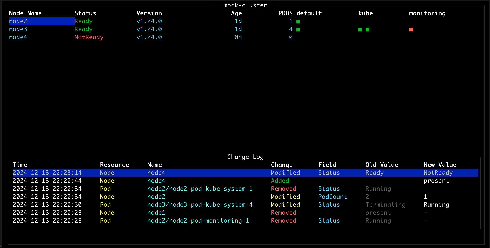
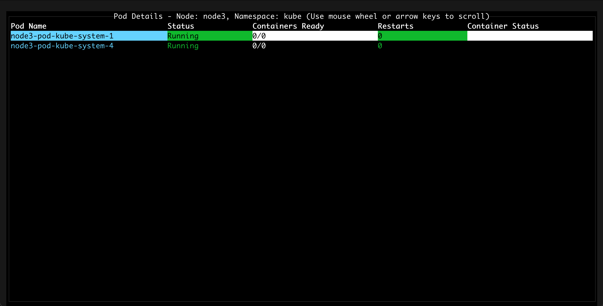
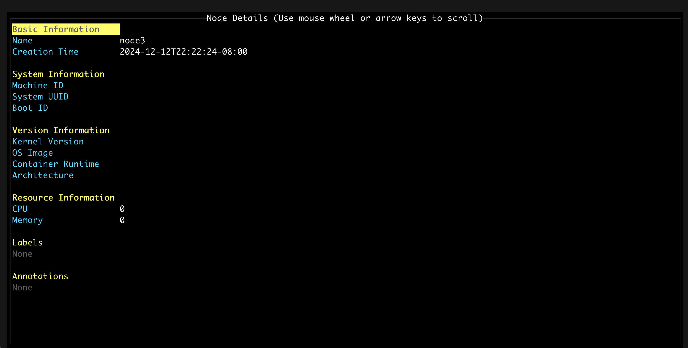

# kubism

A terminal-based Kubernetes dashboard inspired by Pandora's web UI monitoring tool and k9s. This tool provides a lightweight, efficient way to monitor Kubernetes clusters, particularly focused on GKE environments for monitoring node/pod status and quick log access.

## Screenshots

### Main Node List View

The main view shows:
- Node status and information (name, status, version, age, pod count)
- Pod status indicators by namespace (■ green=running, ■ yellow=pending, ■ red=failed/error)
- Real-time change log tracking cluster modifications

### Pod Details View

The pod details view displays:
- List of pods for a selected node and namespace
- Pod status, container readiness, and restart counts
- Quick access to pod logs (press Enter on a pod)

### Node Details View

The node details view shows:
- Detailed node information and status
- System information and resources
- Labels and annotations

## Features

- Real-time monitoring of Kubernetes cluster nodes and pods
- Quick access to pod logs
- Node and pod details views
- Live change tracking
- Search/filter functionality
- Support for namespace filtering
- Color-coded status indicators
- Keyboard-driven navigation

## Installation

1. Ensure you have Go installed on your system
2. Clone the repository
3. Build the project:
```bash
go build
```

## Usage

```bash
./kubism [options]
```

### Command Line Arguments

- `-N`, `--namespace`: Filter by namespace (can be specified multiple times or comma-separated)
  - Prefix with `-` to exclude namespaces
  - Example: `-N kube-system,default` or `-N -kube-system` (to exclude kube-system)
- `--mock-k8s-data`: Use mock Kubernetes data instead of real cluster (useful for testing)
- `--logfile`: Path to file for logging changes

## Keyboard Shortcuts

### Global
- `?` - Show help dialog
- `r` - Refresh data
- `c` - Clear changelog
- `/` - Filter pods
- `Tab` - Switch between main table and changelog
- `Esc` - Close details view or help dialog

### Navigation
- `↑/↓/←/→` - Navigate tables
- `Enter` - Show details (node details on columns 1-5, pod details on namespace columns)
- `PgUp/PgDn` - Page up/down in details view
- `Home/End` - Jump to top/bottom in details view

### Views
- **Node Details**: Press Enter on node columns (columns 1-5)
- **Pod Details**: Press Enter on pod columns (namespace columns)
- **Log View**: Press Enter on a pod in pod details view

## Primary Use Cases

1. **Node Monitoring**
   - Quick overview of node status and health
   - Track node version consistency
   - Monitor pod distribution across nodes

2. **Pod Management**
   - Real-time pod status monitoring
   - Quick access to pod logs
   - Track pod restarts and status changes

3. **Troubleshooting**
   - Identify problematic nodes/pods
   - Access logs for debugging
   - Track cluster changes in real-time

## Inspired By
- Pandora's web UI monitoring tool
- k9s command-line UI

## License

See [LICENSE](LICENSE) file for details.
